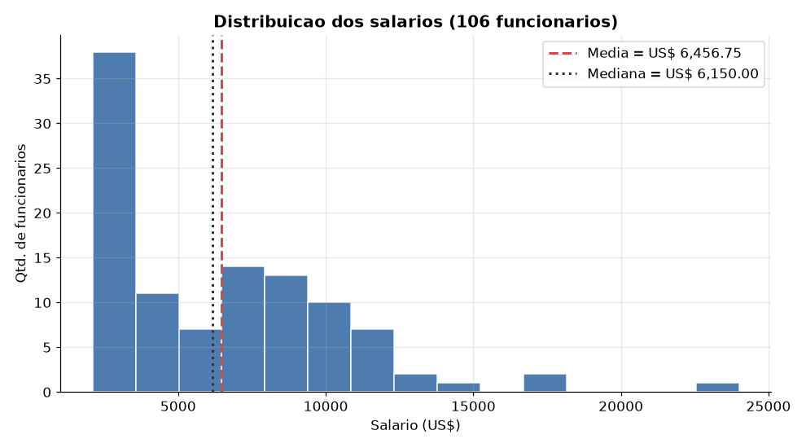
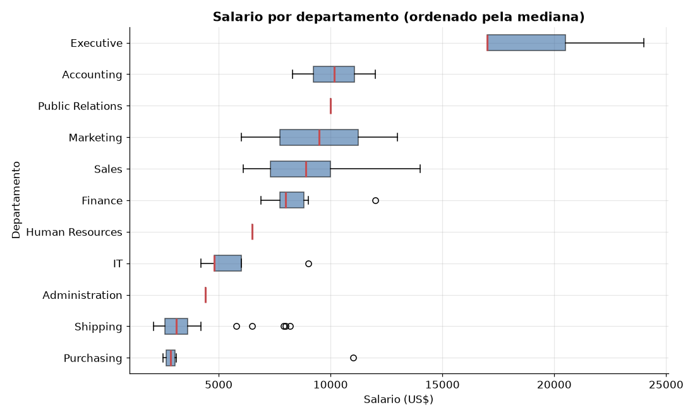
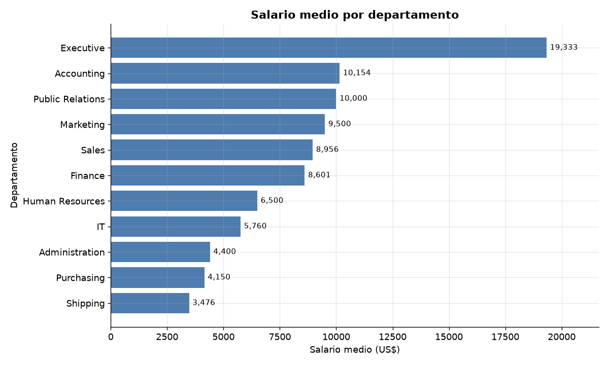
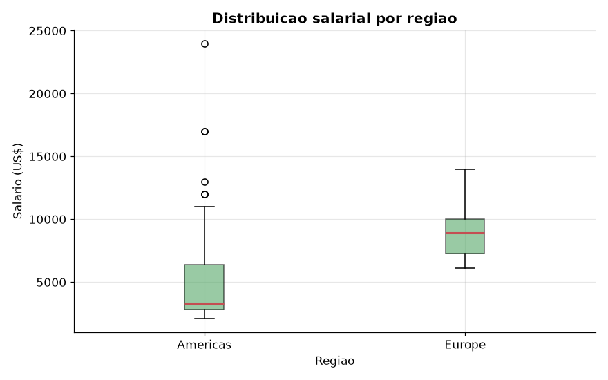
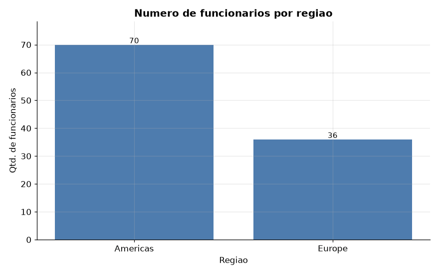

# Visualização de Dados e Business Intelligence [T3] — Projeto Avaliativo (Módulo 1)

Análise de dados de **Recursos Humanos (RH)** a partir do banco **FreeSQL**, esquema
**Human Resources (HR)**. O projeto extrai informações com **SQL** (usando `LEFT JOIN` e
filtros `WHERE`), exporta os resultados para **CSV** e realiza uma **Análise Exploratória
de Dados (EDA)** em **Python**, com cálculo de medidas estatísticas e geração de gráficos.

- **Aluno:** Diogo Durval Koerich Pereira
- **Turma:** T3 — Visualização de Dados e Business Intelligence
- **Módulo:** 1 — Semana 13 (Situação de Aprendizagem / Projeto Avaliativo)

---

## Sumário

1. [Objetivo do trabalho](#1-objetivo-do-trabalho)
2. [Tabelas usadas da base HR](#2-tabelas-usadas-da-base-hr)
3. [As duas consultas SQL](#3-as-duas-consultas-sql)
4. [A análise em Python (EDA)](#4-a-análise-em-python-eda)
5. [Principais resultados](#5-principais-resultados)
6. [Gráficos gerados](#6-gráficos-gerados)
7. [Como executar o projeto](#7-como-executar-o-projeto)
8. [Estrutura do repositório](#8-estrutura-do-repositório)
9. [Sugestões de melhorias](#9-sugestões-de-melhorias-para-versões-futuras)
10. [Vídeo de apresentação](#10-vídeo-de-apresentação)

---

## 1. Objetivo do trabalho

Praticar o fluxo completo de trabalho de um analista de dados de RH:

- **Buscar** dados na base HR com consultas SQL objetivas;
- **Relacionar** tabelas com `LEFT JOIN` e **filtrar** registros com `WHERE`;
- **Exportar** os resultados para arquivos CSV;
- **Explorar** os dados em Python (pandas), calculando **média, mediana, mínimo e máximo**;
- **Visualizar** a distribuição dos salários com **histograma, boxplot e gráficos de barras**;
- **Interpretar** os números para gerar insights úteis (e reconhecer suas limitações) para
  decisões de RH sobre **cargos, departamentos e distribuição geográfica de salários**.

---

## 2. Tabelas usadas da base HR

O esquema HR descreve uma empresa: funcionários, cargos, departamentos e a localização
geográfica de cada departamento. Foram utilizadas **6 tabelas**:

| Tabela | O que representa | Campos principais usados |
|---|---|---|
| **EMPLOYEES** | Funcionários da empresa | `EMPLOYEE_ID`, `FIRST_NAME`, `LAST_NAME`, `SALARY`, `JOB_ID`, `DEPARTMENT_ID` |
| **DEPARTMENTS** | Departamentos | `DEPARTMENT_ID`, `DEPARTMENT_NAME`, `LOCATION_ID` |
| **JOBS** | Cargos e faixas salariais | `JOB_ID`, `JOB_TITLE`, `MIN_SALARY`, `MAX_SALARY` |
| **LOCATIONS** | Endereços/locais dos departamentos | `LOCATION_ID`, `CITY`, `STATE_PROVINCE`, `COUNTRY_ID` |
| **COUNTRIES** | Países | `COUNTRY_ID`, `COUNTRY_NAME`, `REGION_ID` |
| **REGIONS** | Regiões do mundo | `REGION_ID`, `REGION_NAME` |

**Como as tabelas se conectam:**
`EMPLOYEES.DEPARTMENT_ID → DEPARTMENTS.DEPARTMENT_ID → LOCATIONS.LOCATION_ID →
COUNTRIES.COUNTRY_ID → REGIONS.REGION_ID` e `EMPLOYEES.JOB_ID → JOBS.JOB_ID`.
Observe que o funcionário **não** tem localização própria: ela é herdada do **departamento**.

> **Origem dos dados:** foi utilizado o conjunto de exemplo padrão da base HR (o mesmo
> disponibilizado no FreeSQL). Para garantir a **reprodutibilidade** sem depender de acesso
> externo, o script [`python/gerar_dados.py`](python/gerar_dados.py) recria essa base em um
> SQLite local e roda **exatamente** o SQL dos arquivos `sql/query_1.sql` e `sql/query_2.sql`,
> gerando os CSV entregues. O script [`sql/hr_seed_mysql.sql`](sql/hr_seed_mysql.sql) permite
> recriar a mesma base diretamente no FreeSQL/MySQL.

---

## 3. As duas consultas SQL

### Query 1 — Salário por Departamento e Cargo — [`sql/query_1.sql`](sql/query_1.sql)

- **Objetivo:** analisar a **distribuição de salários por departamento e por cargo**.
- **Relacionamentos:** `EMPLOYEES` **LEFT JOIN** `DEPARTMENTS` **LEFT JOIN** `JOBS`.
- **Filtro (`WHERE`):** `WHERE e.DEPARTMENT_ID IS NOT NULL` — mantém apenas funcionários
  formalmente alocados a um departamento.
- **Saída:** [`dados/query_01.csv`](dados/query_01.csv) — 106 linhas (`EMPLOYEE_ID`,
  `EMPLOYEE_NAME`, `DEPARTMENT_NAME`, `JOB_TITLE`, `SALARY`).

```sql
SELECT e.EMPLOYEE_ID,
       CONCAT(e.FIRST_NAME, ' ', e.LAST_NAME) AS EMPLOYEE_NAME,
       d.DEPARTMENT_NAME, j.JOB_TITLE, e.SALARY
FROM EMPLOYEES e
LEFT JOIN DEPARTMENTS d ON e.DEPARTMENT_ID = d.DEPARTMENT_ID
LEFT JOIN JOBS       j ON e.JOB_ID        = j.JOB_ID
WHERE e.DEPARTMENT_ID IS NOT NULL
ORDER BY d.DEPARTMENT_NAME, e.SALARY DESC;
```

### Query 2 — Funcionários por Região (com localização) — [`sql/query_2.sql`](sql/query_2.sql)

- **Objetivo:** analisar a **distribuição geográfica** dos funcionários e as diferenças
  salariais por **Cidade, Estado, País e Região**.
- **Relacionamentos:** `EMPLOYEES` **LEFT JOIN** `DEPARTMENTS` **LEFT JOIN** `LOCATIONS`
  **LEFT JOIN** `COUNTRIES` **LEFT JOIN** `REGIONS` (4 `LEFT JOIN` encadeados).
- **Filtro (`WHERE`):** `WHERE r.REGION_NAME IS NOT NULL` — mantém apenas registros com
  região identificada.
- **Saída:** [`dados/query_02.csv`](dados/query_02.csv) — 106 linhas (`EMPLOYEE_ID`,
  `EMPLOYEE_NAME`, `DEPARTMENT_NAME`, `CITY`, `STATE_PROVINCE`, `COUNTRY_NAME`,
  `REGION_NAME`, `SALARY`).

```sql
SELECT e.EMPLOYEE_ID,
       CONCAT(e.FIRST_NAME, ' ', e.LAST_NAME) AS EMPLOYEE_NAME,
       d.DEPARTMENT_NAME, l.CITY, l.STATE_PROVINCE,
       c.COUNTRY_NAME, r.REGION_NAME, e.SALARY
FROM EMPLOYEES e
LEFT JOIN DEPARTMENTS d ON e.DEPARTMENT_ID = d.DEPARTMENT_ID
LEFT JOIN LOCATIONS   l ON d.LOCATION_ID   = l.LOCATION_ID
LEFT JOIN COUNTRIES   c ON l.COUNTRY_ID    = c.COUNTRY_ID
LEFT JOIN REGIONS     r ON c.REGION_ID     = r.REGION_ID
WHERE r.REGION_NAME IS NOT NULL
ORDER BY r.REGION_NAME, c.COUNTRY_NAME, e.SALARY DESC;
```

> **Efeito dos filtros:** a base tem 107 funcionários, mas as duas consultas retornam **106**.
> O funcionário **Kimberely Grant** (`EMPLOYEE_ID = 178`, *Sales Representative*) está com
> `DEPARTMENT_ID` **nulo** na base. Como a região só é alcançada através do departamento, ele
> é removido pelos dois filtros — um pequeno caso de **qualidade de dados** que vale destacar
> antes de qualquer decisão de RH.

---

## 4. A análise em Python (EDA)

O script [`python/analise.py`](python/analise.py) (e o notebook equivalente
[`python/analise.ipynb`](python/analise.ipynb)) realiza:

1. **Importação** dos dois CSV com `pandas`;
2. **EDA** simples: formato (`shape`), tipos (`dtypes`), valores ausentes (`isna`) e
   primeiras linhas (`head`);
3. **Medidas estatísticas** do salário: média, mediana, mínimo, máximo, desvio-padrão e
   quartis (`describe`);
4. **Comparações** com `groupby`: salário por **departamento**, por **cargo** e por **região**;
5. **Gráficos**: histograma, boxplots (por departamento e por região) e gráficos de barras,
   salvos na pasta [`graficos/`](graficos/).

---

## 5. Principais resultados

### Visão geral dos salários (106 funcionários)

| Medida | Valor (US$) |
|---|---:|
| Média (*mean*) | 6.456,75 |
| Mediana (*median*) | 6.150,00 |
| Mínimo (*min*) | 2.100,00 |
| Máximo (*max*) | 24.000,00 |
| Desvio-padrão (*std*) | 3.927,80 |
| 1º quartil (Q1) | 3.100,00 |
| 3º quartil (Q3) | 8.950,00 |

**Média (6.456,75) > Mediana (6.150,00):** a distribuição é **assimétrica à direita** — a
maioria ganha salários mais baixos e poucos salários muito altos (diretoria) puxam a média
para cima. O salário mínimo é de um *Stock Clerk* e o máximo é do **Presidente** (Steven King).

### Salário por departamento

| Departamento | Funcionários | Média (US$) | Mediana (US$) |
|---|---:|---:|---:|
| Executive | 3 | 19.333,33 | 17.000,00 |
| Accounting | 2 | 10.154,00 | 10.154,00 |
| Public Relations | 1 | 10.000,00 | 10.000,00 |
| Marketing | 2 | 9.500,00 | 9.500,00 |
| Sales | 34 | 8.955,88 | 8.900,00 |
| Finance | 6 | 8.601,33 | 8.000,00 |
| Human Resources | 1 | 6.500,00 | 6.500,00 |
| IT | 5 | 5.760,00 | 4.800,00 |
| Administration | 1 | 4.400,00 | 4.400,00 |
| Purchasing | 6 | 4.150,00 | 2.850,00 |
| Shipping | 45 | 3.475,56 | 3.100,00 |

- Maior média: **Executive** (~US$ 19.333); menor média: **Shipping** (~US$ 3.476).
- Os dois maiores departamentos em número de pessoas são operacionais/comerciais:
  **Shipping (45)** e **Sales (34)**.

### Salário por cargo (destaques)

- **Maiores médias:** President (24.000), Administration Vice President (17.000),
  Marketing Manager (13.000), Sales Manager (12.200), Finance Manager (12.008).
- **Menores médias:** Purchasing Clerk (2.780), Stock Clerk (2.785), Shipping Clerk (3.215),
  Administration Assistant (4.400), Programmer (5.760).

### Distribuição por região

| Região | Funcionários | Média (US$) | Mediana (US$) |
|---|---:|---:|---:|
| Americas | 70 | 5.191,66 | 3.300,00 |
| Europe | 36 | 8.916,67 | 8.900,00 |

Por país: **EUA (68)**, **Reino Unido (35)**, **Canadá (2)** e **Alemanha (1)**.

**Insight principal:** a região **Americas** concentra a maioria dos funcionários (70), mas com
mediana baixa (US$ 3.300), porque reúne as áreas operacionais (Shipping/Stock, nos EUA) — além
de conter os *outliers* da diretoria. A **Europe** tem menos gente (36), porém mediana bem
maior (US$ 8.900), pois é formada sobretudo por **Vendas** (Reino Unido) e **Relações
Públicas** (Alemanha). Ou seja, a diferença regional reflete o **mix de cargos**, não
necessariamente um "país que paga mais".

---

## 6. Gráficos gerados

### Distribuição dos salários (histograma)


### Salário por departamento (boxplot)


### Salário médio por departamento (barras)


### Distribuição salarial por região (boxplot)


### Número de funcionários por região (barras)


---

## 7. Como executar o projeto

### Pré-requisitos
- **Python 3.9+** instalado.
- (Opcional) acesso ao **FreeSQL** caso queira rodar o SQL diretamente na nuvem.

### Passo a passo

```bash
# 1) Clonar o repositório
git clone <URL_DO_REPOSITORIO>
cd VISUALIZA-O-DE-DADOS-E-BUSINESS-INTELLIGENCE-T3-

# 2) (Recomendado) criar e ativar um ambiente virtual
python -m venv .venv
source .venv/bin/activate        # Windows: .venv\Scripts\activate

# 3) Instalar as bibliotecas
pip install -r requirements.txt

# 4) (Opcional) Recriar os CSV a partir das consultas SQL
python python/gerar_dados.py

# 5) Rodar a análise exploratória e gerar os gráficos
python python/analise.py
```

Os gráficos são salvos em `graficos/` e as medidas estatísticas são impressas no terminal.

**Para usar o notebook:**
```bash
jupyter notebook python/analise.ipynb
```

**Para rodar as consultas no FreeSQL (opcional):** carregue a base com
`sql/hr_seed_mysql.sql` (ou use o esquema HR já disponível) e execute
`sql/query_1.sql` e `sql/query_2.sql`, exportando cada resultado como
`query_01.csv` e `query_02.csv`.

---

## 8. Estrutura do repositório

```
.
├── README.md                       # este arquivo (documentação)
├── requirements.txt                # bibliotecas Python
├── sql/
│   ├── query_1.sql                 # Query 1 — Salário por Departamento e Cargo
│   ├── query_2.sql                 # Query 2 — Funcionários por Região
│   └── hr_seed_mysql.sql           # carga da base HR para FreeSQL/MySQL (reprodutibilidade)
├── dados/
│   ├── query_01.csv                # resultado da Query 1
│   └── query_02.csv                # resultado da Query 2
├── python/
│   ├── gerar_dados.py              # recria a base HR e gera os CSV a partir do SQL
│   ├── analise.py                  # EDA + estatísticas + gráficos
│   └── analise.ipynb               # mesma análise em notebook (com saídas)
├── graficos/                       # PNGs gerados pela análise
│   ├── histograma_salarios.png
│   ├── boxplot_salario_departamento.png
│   ├── barras_media_salario_departamento.png
│   ├── boxplot_salario_regiao.png
│   └── barras_funcionarios_regiao.png
└── docs/
    └── roteiro_video.md            # roteiro da apresentação em vídeo
```

---

## 9. Sugestões de melhorias para versões futuras

- **Enriquecer os dados:** incluir data de admissão (tempo de casa/senioridade), comissão e
  jornada para explicar melhor as diferenças salariais.
- **Ajuste por custo de vida:** comparar salários entre regiões usando paridade de poder de
  compra, e não valores nominais.
- **Segmentar por cargo dentro do departamento** (ex.: gerentes vs. operacional) para separar
  o efeito "área" do efeito "nível hierárquico".
- **Dashboard interativo** (Power BI, Streamlit ou Plotly) com filtros por região, cargo e
  faixa salarial.
- **Automação do pipeline:** conectar o Python diretamente ao banco (SQLAlchemy) para
  atualizar CSV e gráficos automaticamente.
- **Testes de qualidade de dados:** validações automáticas para registros nulos (como o caso
  do funcionário sem departamento) antes da análise.

---

## 10. Vídeo de apresentação

O roteiro da apresentação técnica (até 7 minutos), respondendo às perguntas exigidas na
Seção 3.3 do enunciado, está em [`docs/roteiro_video.md`](docs/roteiro_video.md).

**Link do vídeo:**(https://youtu.be/F2zXRP_djwg)
